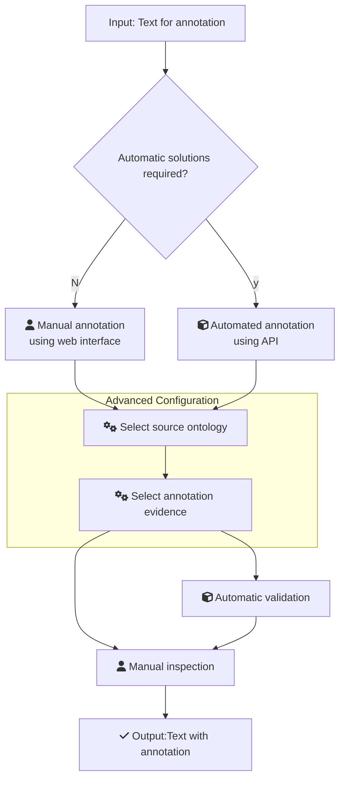

# Ontology annotation with ZOOMA

# Table of Contents
1. [Main FAIRification Objectives](#Main%20FAIRification%20Objectives)
2. [Graphical Overview of the FAIRification Recipe Objectives](#Graphical%20Overview%20of%20the%20FAIRification%20Recipe%20Objectives)
3. [FAIRification Objectives, Inputs and Outputs](#FAIRification%20Objectives,%20Inputs%20and%20Outputs)
4. [Capability & Maturity Table](#Capability%20&%20Maturity%20Table)
5. [Table of Data Standards](#Table%20of%20Data%20Standards)
6. [Executable Code in Notebook](#Executable%20Code%20in%20Notebook)
7. [How to create workflow figures](#How%20to%20create%20workflow%20figures)
8. [License](#License)

---

## Main Objectives

The main purpose of this recipe is:

> - Providing manual and automated solutions to perform ontology term annotation
> - Providing an example of validation ontology term validation
___


## Graphical Overview of the FAIRification Recipe Objectives

[](https://mermaid-js.github.io/mermaid-live-editor/#/edit/eyJjb2RlIjoiXG5ncmFwaCBURFxuICAgIEFbZmE6ZmEtZmlsZS10ZXh0LW8gSW5wdXQ6IFRleHQgZm9yIGFubm90YXRpb25dLS0-QntBdXRvbWF0aWMgc29sdXRpb25zIHJlcXVpcmVkP31cbiAgICBCLS0-fE58Q1tmYTpmYS11c2VyIE1hbnVhbCBhbm5vdGF0aW9uIDxicj4gdXNpbmcgd2ViIGludGVyZmFjZV1cbiAgICBDLS0-RFtmYTpmYS1jb2dzIFNlbGVjdCBzb3VyY2Ugb250b2xvZ3ldXG4gICAgQi0tPnx5fEMxW2ZhOmZhLWN1YmUgQXV0b21hdGVkIGFubm90YXRpb24gPGJyPnVzaW5nIEFQSV1cbiAgICBDMS0tPkRcblxuICAgICAgc3ViZ3JhcGggQWR2YW5jZWQgQ29uZmlndXJhdGlvblxuICAgICAgICBEIC0tPiBEMVtmYTpmYS1jb2dzIFNlbGVjdCBhbm5vdGF0aW9uIGV2aWRlbmNlXVxuICAgICAgZW5kXG5cbiAgICBEMS0tPkVbZmE6ZmEtdXNlciBNYW51YWwgaW5zcGVjdGlvbl1cbiAgICBcbiAgICBEMS0tPkUxW2ZhOmZhLWN1YmUgQXV0b21hdGljIHZhbGlkYXRpb25dXG4gICAgRTEtLT5FXG4gICAgRSAtLT5GW2ZhOmZhLWNoZWNrIE91dHB1dDpUZXh0IHdpdGggYW5ub3RhdGlvbl0iLCJtZXJtYWlkIjp7InRoZW1lIjoibmV1dHJhbCJ9fQ)

___
## User Stories
>TODO
>
| As a ...  | I want to ... | So that ... |
|----------|:-------------:|------:|
|Data analyst|Annotate free text to ontology terms|??|
|Data librarian|Perform dvfdsdfsfdsdgfgfo|   gds dgf|
| sgffd | gsdf |    gsdf |
        
## Capability & Maturity Table

| Capability  | Initial Maturity Level | Final Maturity Level  |
| :------------- | :------------- | :------------- |
| Interoperability | minimal | repeatable |

----


## FAIRification Objectives, Inputs and Outputs

| Actions.Objectives.Tasks  | Input | Output  |
| :------------- | :------------- | :------------- |
| [text annotation](http://edamontology.org/operation_3778)  | Ontology| [annotated text](http://edamontology.org/data_3779)  |


## Table of Data Standards

| Data Formats  | Terminologies | Models  |
| :------------- | :------------- | :------------- |
| [Text](http://edamontology.org/data_3671)  |  |     |
| [CSV](http://edamontology.org/format_3752)  |  | |

___
### Benefit of ontology annotation
dfasdasfas
### ZOOMA intro
1. text 2. annotation evidence 

This recipe provides examples of using ZOOMA for ontology annotation both manually and automatically.

### Step 0: Example data for annotation
The example data for annotation is cell line metadata from the EBiSC registry, see below. The [original data](https://www.ebi.ac.uk/biosamples/samples/SAMEA104623616) can be found on the BioSamples database.

_Table 1: Example data for annotation_
|Attribute name| Attribute value|
|---------------|--------|
| cell type     | induced pluripotent stem cell| 
| disease state | normal|   
| donor id      | SAMEA3105780|   
| material      | cell line|   
| organism      | Homo sapiens |   
| project       | EBiSC |   
| sex           | female |   
| synonym       | BIONi010-C heterozygous TREM2 KO|   
| title         | Induced Pluripotent Stem Cell Line BIONi010-C-25|

#### Step 1: Bacis Annotation

#### Manual annotation
__Input__
weblink, line break seperated, maximum term limit


_Image 1: ZOOMA input example_

__Output__
- only values, mapping confidence (how it was calculated, source)
- zooma download as CSV table.


_Image 2: ZOOMA output example 1, webform_

#### Automation, API
1. general
>https://www.ebi.ac.uk/spot/zooma/v2/api/services/annotate?propertyValue=keyword_a
e.g. normal
```sh
curl https://www.ebi.ac.uk/spot/zooma/v2/api/services/annotate?propertyValue=normal
```
Example output, include semantic tags, provenance, confidence and curation details. e.g.

```
[{'uri': None,
	'annotatedProperty': {
		'uri': 'http://rdf.ebi.ac.uk/resource/zooma/40EA3327BFCCBB34E3ACA740B6D0E0D8',
		'propertyType': 'disease',
		'propertyValue': 'normal'
	},
	'_links': {
		'olslinks': [{
			'href': 'https://www.ebi.ac.uk/ols/api/terms?iri=http%3A%2F%2Fpurl.obolibrary.org%2Fobo%2FPATO_0000461',
			'semanticTag': 'http://purl.obolibrary.org/obo/PATO_0000461'
		}]
	},
	'semanticTags': ['http://purl.obolibrary.org/obo/PATO_0000461'],
	'replacedBy': [],
	'replaces': [],
	'derivedFrom': {
		'uri': 'http://rdf.ebi.ac.uk/resource/zooma/atlas/35511DFDA524E499B43611B07A437198',
    ...
```
Complete output [here](https://gist.githubusercontent.com/FuqiX/45809dfbbf75f7d1b350367501adeb97/raw/79e01ad93f328be8f2b6dfc120a9e9385fbb3772/ZOOMA_API_output)

Example code for auto annotating the table above
```python
read_table
requests
parse
output
```

### Step 2: Advance configuration__

#### Step 2.1 curation data source
__Manual__ 

_Image 3: ZOOMA configuration, curation datasources__
maybe come from expression atlas
curation source example. (BSD tsv table), include attribute name
high confidence overwrite others

Example of ZOOMA curation evidence
| STUDY | BIOENTITY    | PROPERTY_TYPE    | PROPERTY_VALUE      | SEMANTIC_TAG                                     | ANNOTATOR | ANNOTATION_DATE     |
|--|----|---------|--------|------|-------|---------|
|       | SAMN14168014 | strain           | SARS-CoV-2          | http://purl.obolibrary.org/obo/NCBITaxon_2697049 |Curator_A   | 2020-04-14 17:00:00 |
|       | SAMN14450688 | host disease     | COVID19             | http://purl.obolibrary.org/obo/MONDO_0100096     |Curator_A   | 2020-04-14 17:00:00 |
|       | SAMN14428242 | isolation source | nasal swab          | http://purl.obolibrary.org/obo/NCIT_C155833      |Curator_B   | 2020-04-14 17:00:00 |
|       | SAMEA6880656 | Organism         | Homo Sapien         | http://purl.obolibrary.org/obo/NCBITaxon_9606    |Curator_A  | 2020-04-14 17:00:00 |
__API__

#### Step 2.2 curation ontology source


_Image 4: ZOOMA configuration, ontology sources__
OLS provides 200+ ontologies
e.g.


### Step 2.3 Other advanced curation

> point to ZOOMA documentation
- Specify property type
https://www.ebi.ac.uk/spot/zooma/v2/api/services/annotate?propertyValue=mus+musculus&propertyType=organism
- 1.Required annotation source, use annotations from 'atlas' and 'gwas'
https://www.ebi.ac.uk/spot/zooma/v2/api/services/annotate?propertyValue=mus+musculus&propertyType=organism&filter=required:[atlas,gwas]
- 2. Preferred annotation source, use 'atlas' and 'gwas' annotations and give preference to 'gwas'
- 3. Specific ontology source
https://www.ebi.ac.uk/spot/zooma/v2/api/services/annotate?propertyValue=mus+musculus&propertyType=organism&filter=required:[atlas,gwas],ontologies:[none]

### Warning, zooma is biased

Curated datasources = all, preferred ontology = none

_Figure 1: ZOOMA configuring example 1, using all curated datasource_


Curated datasources = none, preferred ontology = none

_Figure 2: ZOOMA configuring example 1, don't using curated datasource_


Curated datasources = none, preferred ontology = NCIT

_Figure 3: ZOOMA configuring example 1, specify ontology source_

#### Solution
ZOOMA + OLS


### Oppurtunities
ZOOMA local instance, ZOOMA open source https://github.com/EBISPOT/zooma

Example of curation source


## Summary
1. a good solution with zooma
2. limitations and validation needed
3. general comments about ontology annotation

### Related recipes
- :octopus: [What is ontology]()
- :octopus: [What is OLS and ZOOMA]()
- :octopus: [Ontology source recommendation]
### References


## Authors:

| Name | Affiliation  | orcid | CrediT role  |
| :------------- | :------------- | :------------- |:------------- |
|Fuqi Xu|[EMBL-EBI](https://www.ebi.ac.uk)| [0000-0002-5923-3859](https://orcid.org/orcid.org/0000-0002-5923-3859) | Writing - Original Draft |
___


## License:

<a href="https://creativecommons.org/licenses/by/4.0/"></a>
