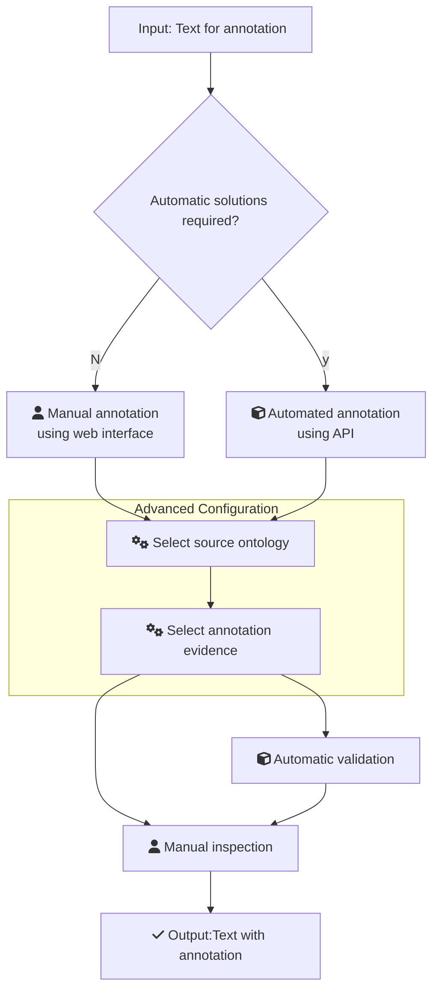

# Ontology annotation with ZOOMA

# Table of Contents
1. [Main FAIRification Objectives](#Main%20FAIRification%20Objectives)
2. [Graphical Overview of the FAIRification Recipe Objectives](#Graphical%20Overview%20of%20the%20FAIRification%20Recipe%20Objectives)
3. [FAIRification Objectives, Inputs and Outputs](#FAIRification%20Objectives,%20Inputs%20and%20Outputs)
4. [Capability & Maturity Table](#Capability%20&%20Maturity%20Table)
5. [Table of Data Standards](#Table%20of%20Data%20Standards)
6. [Executable Code in Notebook](#Executable%20Code%20in%20Notebook)
7. [How to create workflow figures](#How%20to%20create%20workflow%20figures)
8. [License](#License)

---

## Main Objectives

The main purpose of this recipe is:

> - Providing manual and automated solutions to perform ontology term annotation
> - Providing an example of validation ontology term validation
___

## Graphical Overview of the FAIRification Recipe Objectives

[](https://mermaid-js.github.io/mermaid-live-editor/#/edit/eyJjb2RlIjoiXG5ncmFwaCBURFxuICAgIEFbZmE6ZmEtZmlsZS10ZXh0LW8gSW5wdXQ6IFRleHQgZm9yIGFubm90YXRpb25dLS0-QntBdXRvbWF0aWMgc29sdXRpb25zIHJlcXVpcmVkP31cbiAgICBCLS0-fE58Q1tmYTpmYS11c2VyIE1hbnVhbCBhbm5vdGF0aW9uIDxicj4gdXNpbmcgd2ViIGludGVyZmFjZV1cbiAgICBDLS0-RFtmYTpmYS1jb2dzIFNlbGVjdCBzb3VyY2Ugb250b2xvZ3ldXG4gICAgQi0tPnx5fEMxW2ZhOmZhLWN1YmUgQXV0b21hdGVkIGFubm90YXRpb24gPGJyPnVzaW5nIEFQSV1cbiAgICBDMS0tPkRcblxuICAgICAgc3ViZ3JhcGggQWR2YW5jZWQgQ29uZmlndXJhdGlvblxuICAgICAgICBEIC0tPiBEMVtmYTpmYS1jb2dzIFNlbGVjdCBhbm5vdGF0aW9uIGV2aWRlbmNlXVxuICAgICAgZW5kXG5cbiAgICBEMS0tPkVbZmE6ZmEtdXNlciBNYW51YWwgaW5zcGVjdGlvbl1cbiAgICBcbiAgICBEMS0tPkUxW2ZhOmZhLWN1YmUgQXV0b21hdGljIHZhbGlkYXRpb25dXG4gICAgRTEtLT5FXG4gICAgRSAtLT5GW2ZhOmZhLWNoZWNrIE91dHB1dDpUZXh0IHdpdGggYW5ub3RhdGlvbl0iLCJtZXJtYWlkIjp7InRoZW1lIjoibmV1dHJhbCJ9fQ)

___
## User Stories
>TODO
>
| As a ...  | I want to ... | So that ... |
|----------|:-------------:|------:|
|Data analyst|Annotate free text to ontology terms|??|
|Data librarian|Perform dvfdsdfsfdsdgfgfo|   gds dgf|
| sgffd | gsdf |    gsdf |
        
## Capability & Maturity Table

| Capability  | Initial Maturity Level | Final Maturity Level  |
| :------------- | :------------- | :------------- |
| Interoperability | minimal | repeatable |

----

## FAIRification Objectives, Inputs and Outputs

| Actions.Objectives.Tasks  | Input | Output  |
| :------------- | :------------- | :------------- |
| [text annotation](http://edamontology.org/operation_3778)  | Ontology| [annotated text](http://edamontology.org/data_3779)  |

## Table of Data Standards

| Data Formats  | Terminologies | Models  |
| :------------- | :------------- | :------------- |
| [Text](http://edamontology.org/data_3671)  |  |     |
| [CSV](http://edamontology.org/format_3752)  |  | |

___
### Benefit of ontology annotation
dfasdasfas
### ZOOMA intro
1. text 2. annotation evidence 
### Two examples
1. manual 
2. API

#### Manual annotation
#### Example data
biospeciement nasal swab
#### Basics
screenshot
##### Configuring
source and :octopus: ontology recommendation recip
#### Output explained
confidence, evidence, term and purl

### Automated annotation
API doc
#### Basics
Output explained
#### Configuring
select preferred source
#### Automated validation
limitations of zooma

### Manual inspection
- correct source?
- correct terms?
    e.g. specimen can be biometerial or method

## Summary
1. a good solution with zooma
2. limitations and validation needed
3. general comments about ontology annotation

### Related recipes
- :octopus: [What is ontology]()
- :octopus: [What is OLS and ZOOMA]()
- :octopus: [Ontology source recommendation]
### References

## Authors:

| Name | Affiliation  | orcid | CrediT role  |
| :------------- | :------------- | :------------- |:------------- |
|Fuqi Xu|[EMBL-EBI](https://www.ebi.ac.uk)| [0000-0002-5923-3859](https://orcid.org/orcid.org/0000-0002-5923-3859) | Writing - Original Draft |
___

## License:

