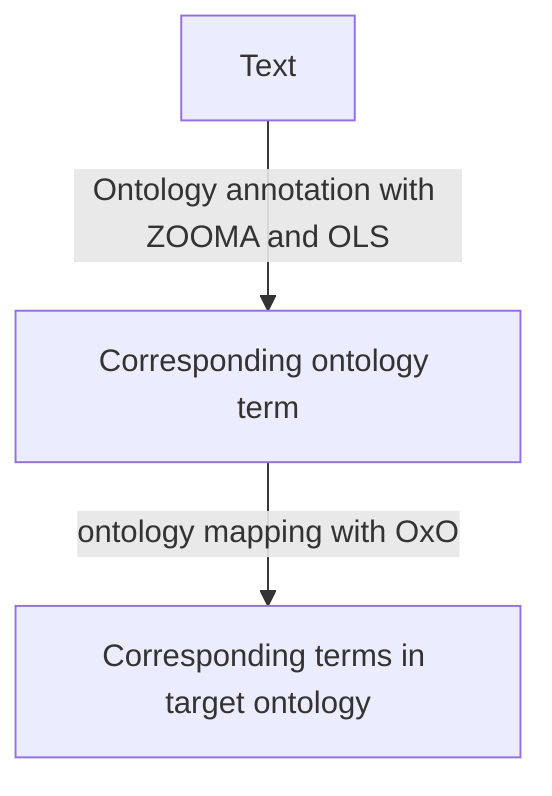

# Ontology mapping with Ontology Xref Service (OxO)

### Table of Contents
1. [Main FAIRification Objectives](##%20Main%20Objectives)
2. [Graphical Overview of the FAIRification Recipe Objectives](#Graphical-Overview-of-the-FAIRification-Recipe-Objectives)
3. [FAIRification Objectives, Inputs and Outputs](#FAIRification%20Objectives,%20Inputs%20and%20Outputs)
4. [Capability & Maturity Table](#Capability%20&%20Maturity%20Table)
5. [Table of Data Standards](#Table%20of%20Data%20Standards)
6. [Executable Code in Notebook](#Executable%20Code%20in%20Notebook)
7. [How to create workflow figures](#How%20to%20create%20workflow%20figures)
8. [License](#License)
9. [Summary](#Summary)

## Main Objectives

The main purpose of this recipe is:

> - to demostrate how to map ontology terms both manually and automatically with the [EMBL-EBI Ontology Xref Service (OxO)](https://www.ebi.ac.uk/spot/oxo/).


## Graphical Overview of the FAIRification Recipe Objectives


## User Stories

The table below lists common ontology mapping use cases. This recipe provides solutions with OxO as an example

|As a ..| I want to .. |So that I can ..|
|---|--|--|
|Ontologies|connect terms in the in-house ontology with terms in public ontologies|reduce the cost of developing and maintaining in-house ontologies |
|Data owner| convert ontology annotation with one source ontology to another source ontology|Exchange data with other databases|

## Capability & Maturity Table

| Capability  | Initial Maturity Level | Final Maturity Level  |
| :------------- | :------------- | :------------- |
| Interoperability | minimal | repeatable,automatable |

----

## FAIRification Objectives, Inputs and Outputs

| Actions.Objectives.Tasks  | Input | Output  |
| :------------- | :------------- | :------------- |
| [ID mapping](http://edamontology.org/operation_3282)  | [Ontology term](http://edamontology.org/data_0966)  | [Ontology term](http://edamontology.org/data_0966)  |


## Table of Data Standards

| Data Formats  | Terminologies | Models  |
| :------------- | :------------- | :------------- |

> :bulb: Audiences are expected to be familiar with ontology annotation, and have basic knowledge about using ontologies.

----

Ontologies are created by different communities to cater different use cases, which reults in multiple terms describing the same or similar concepts. This makes it difficult for data integration. Ideally, different terms should be represented using one single solution. Ontology mapping services tackles this problem by mapping terms in different ontologies that describes the same concept.


<center> <i>Figure 1: Example of different terms describing the same concept</i></center>

EMBL-EBI Ontology Xref Service (OxO) is an ontology mapping services that uses cross-refence information, and expect knowledge to map terms in different classification, taxonomies and ontologies, to allow "better semantic access"

The data source included in OxO includes [all ontologies](https://www.ebi.ac.uk/ols/ontologies) in the OLS and OBO foundry, taxonomies such as the NCBI taxonomony taxonomy, classifications such as the Medical Subject Headings, MeSH, Enzyme Commision nomenclature, EC, Thesaurus, and other knowledge base, such as Wiki data.

The mapping information conves from a variety of sources including the Xref information in OLS, UMLS mappings. It also allows users to provide their own mappings. Based on the number and the confidence of each mapping evidence, OxO  also calculates the mapping distance between different terms. The mapping distance is from 1-3. The greater the distance is, the weaker the evidences are.


<center><i>Figure 2: oxo homepage (date?)</i></center>

In this recipe, we demostrate ontology mapping with oxo by finding corresponding term of type 2 diabetes mellitus from EFO to MeSH. 


## Step 0: Find corresponding ontology terms.
OxO uses the ontolgy term ID rather than the text for mapping to avoid the amibiguity of different terms because of context. Hence, users are supposed to find corresponding ontology term ID first through ontology annottaion first. In this example, we already know the source ontology is DOID, so we use OLS to find the right term for "type 2 diabetes mellitus".

```bash
curl -L http://www.ebi.ac.uk/spot/zooma/v2/api/services/annotate?propertyValue=type+2+diabetes+mellitus&propertyType=disease&filter=ontologies:[efo]
```
The corresponding EFO term is
```json
....
"semanticTags": ["http://www.ebi.ac.uk/efo/EFO_0001360"],
	"replacehttps://hackmd.io/newdBy": [],
	"replaces": [],
	"derivedFrom": {
		"uri": "http://rdf.ebi.ac.uk/resource/zooma/atlas/043EE1FBD71C6F14CE9C7D0C9D4AD7CA",
		"annotatedProperty": {
			"uri": "http://rdf.ebi.ac.uk/resource/zooma/82917B7AF12891610D110B836E215C9D",
			"propertyType": "disease",
			"propertyValue": "type 2 diabetes mellitus"
		}
...
```

So the input for OxO is "EFO_0001360"!

In the image below, the source identifier is "EFO_0001360", and the target vocabulory is MeSH. The mapping distance is 1, direct mapping only.

<center></center>

The output is as below, the corresponding term in MeSH is [MeSH:D003924](https://www.ncbi.nlm.nih.gov/mesh/68003924). The mapping results can be downloaded in other formats.

It's also possible to perform this ontology term mapping automatically. See the [OxO API documentation].(https://www.ebi.ac.uk/spot/oxo/docs/developer) page.

OxO has been dockerize for local deployment. and allowing manually creating curation for target ontology.


### Summary
This recipe uses OxO as an example to demostrate the ontology mapping process.


## Authors:

| Name | Affiliation  | orcid | CrediT role  |
| :------------- | :------------- | :------------- |:------------- |
| Fuqi Xu|[EMBL-EBI](www.ebi.ac.uk)| [0000-0002-5923-3859](https://orcid.org/orcid.org/0000-0002-5923-3859) | Writing - Original Draft |


___


## License:

<a href="https://creativecommons.org/licenses/by/4.0/"></a>


